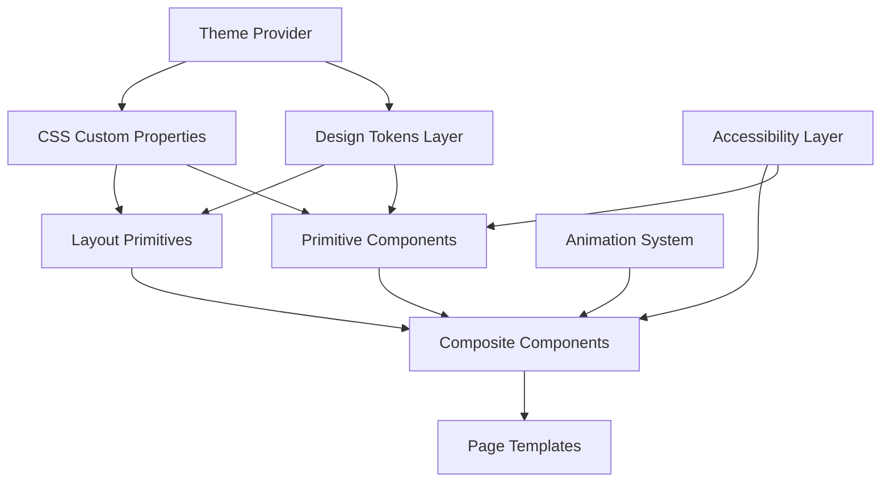
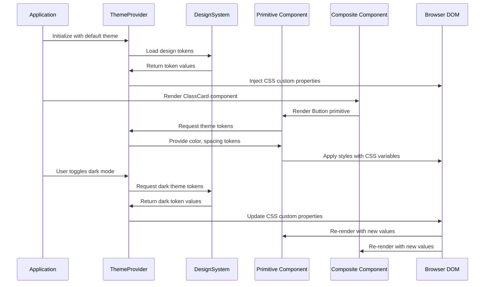

# Design Document: Distinctive Visual Design System Overhaul

## Overview

This design document specifies a comprehensive visual design system overhaul for the PulseFit Studio fitness/yoga class booking application. The current implementation uses a terracotta/espresso aesthetic with Playfair Display and DM Sans typography. This overhaul will refine and systematize the existing distinctive visual language, avoiding generic AI patterns (default Tailwind gradients, Inter/Roboto fonts, centered heroes, icon grids) while creating a reusable, component-based design system that maintains the boutique fitness studio aesthetic.

The design system will introduce: (1) a refined color palette with semantic tokens, (2) typography scale with purposeful hierarchy, (3) spacing and layout primitives, (4) component variants with interaction states, (5) motion and animation guidelines, (6) accessibility compliance patterns, and (7) dark mode support for dashboard interfaces.

## Architecture



### Architecture Overview

The design system follows a layered architecture:

1. **Design Tokens Layer**: Centralized design decisions (colors, typography, spacing) exported as JavaScript constants and CSS custom properties
2. **Theme Provider**: React Context-based theme management supporting light/dark modes and runtime token switching
3. **Primitive Components**: Atomic UI elements (Button, Input, Badge, Card) with variant support
4. **Layout Primitives**: Compositional layout components (Stack, Grid, Container, Section)
5. **Composite Components**: Domain-specific components built from primitives (ClassCard, BookingModal, Navbar)
6. **Page Templates**: Pre-composed page layouts with asymmetric sections and editorial design patterns
7. **Animation System**: Purposeful motion utilities using Framer Motion
8. **Accessibility Layer**: ARIA patterns, keyboard navigation, screen reader support

## Main Algorithm/Workflow



## Components and Interfaces

### Component 1: ThemeProvider

**Purpose**: Manages theme state (light/dark mode), provides design tokens via React Context, and injects CSS custom properties into the document root.

**Interface**:
```typescript
interface ThemeProviderProps {
  children: React.ReactNode;
  defaultTheme?: 'light' | 'dark';
  storageKey?: string;
}

interface ThemeContextValue {
  theme: 'light' | 'dark';
  setTheme: (theme: 'light' | 'dark') => void;
  toggleTheme: () => void;
  tokens: DesignTokens;
}
```

**Responsibilities**:
- Persist theme preference to localStorage
- Inject CSS custom properties on mount and theme change
- Provide theme context to all descendant components
- Support system preference detection via `prefers-color-scheme`

### Component 2: Button Primitive

**Purpose**: Reusable button component with semantic variants, sizes, and interaction states.

**Interface**:
```typescript
interface ButtonProps extends React.ButtonHTMLAttributes<HTMLButtonElement> {
  variant?: 'primary' | 'secondary' | 'outline' | 'ghost' | 'danger';
  size?: 'sm' | 'md' | 'lg';
  isLoading?: boolean;
  leftIcon?: React.ReactNode;
  rightIcon?: React.ReactNode;
  fullWidth?: boolean;
}
```

**Responsibilities**:
- Render consistent button styles across application
- Support keyboard navigation and focus states
- Show loading state with spinner
- Apply proper ARIA attributes
- Support icon composition

### Component 3: Card Primitive

**Purpose**: Flexible container component for content grouping with variants for different contexts.

**Interface**:
```typescript
interface CardProps extends React.HTMLAttributes<HTMLDivElement> {
  variant?: 'default' | 'panel' | 'outlined' | 'elevated';
  padding?: 'none' | 'sm' | 'md' | 'lg';
  interactive?: boolean;
  asChild?: boolean;
}
```

**Responsibilities**:
- Provide consistent card styling with studio-card, studio-panel variants
- Support hover states for interactive cards
- Apply semantic shadow and border tokens
- Support composition via asChild pattern (Radix UI style)

### Component 4: Typography Components

**Purpose**: Semantic typography components enforcing typographic hierarchy and accessibility.

**Interface**:
```typescript
interface HeadingProps extends React.HTMLAttributes<HTMLHeadingElement> {
  level: 1 | 2 | 3 | 4 | 5 | 6;
  as?: 'h1' | 'h2' | 'h3' | 'h4' | 'h5' | 'h6';
  variant?: 'display' | 'headline' | 'title' | 'subhead';
  weight?: 'normal' | 'medium' | 'semibold' | 'bold';
}

interface TextProps extends React.HTMLAttributes<HTMLParagraphElement> {
  size?: 'xs' | 'sm' | 'base' | 'lg' | 'xl';
  weight?: 'normal' | 'medium' | 'semibold' | 'bold';
  color?: 'primary' | 'secondary' | 'tertiary' | 'accent' | 'muted';
  align?: 'left' | 'center' | 'right';
  truncate?: boolean;
  clamp?: number;
}
```

**Responsibilities**:
- Enforce semantic HTML structure (heading levels)
- Apply typography tokens (font families, sizes, line heights)
- Support visual hierarchy decoupled from semantic structure (as prop)
- Provide accessible text colors with sufficient contrast
- Support text truncation with ellipsis or line clamping

### Component 5: Stack Layout Primitive

**Purpose**: Flexbox-based layout primitive for vertical or horizontal stacking with consistent spacing.

**Interface**:
```typescript
interface StackProps extends React.HTMLAttributes<HTMLDivElement> {
  direction?: 'vertical' | 'horizontal';
  spacing?: keyof typeof spacingTokens;
  align?: 'start' | 'center' | 'end' | 'stretch';
  justify?: 'start' | 'center' | 'end' | 'between' | 'around';
  wrap?: boolean;
  divider?: React.ReactNode;
}
```

**Responsibilities**:
- Provide consistent spacing using design tokens
- Support responsive direction changes
- Render dividers between children
- Apply flexbox alignment properties
- Support wrapping behavior

### Component 6: Grid Layout Primitive

**Purpose**: CSS Grid-based layout primitive for responsive multi-column layouts.

**Interface**:
```typescript
interface GridProps extends React.HTMLAttributes<HTMLDivElement> {
  columns?: number | { sm?: number; md?: number; lg?: number; xl?: number };
  gap?: keyof typeof spacingTokens;
  alignItems?: 'start' | 'center' | 'end' | 'stretch';
  justifyItems?: 'start' | 'center' | 'end' | 'stretch';
}
```

**Responsibilities**:
- Create responsive grid layouts with breakpoint-aware columns
- Apply consistent gap spacing using tokens
- Support asymmetric column spans via child props
- Handle auto-fit and auto-fill behaviors

### Component 7: ClassCard Composite

**Purpose**: Domain-specific component for displaying class information, built from primitives.

**Interface**:
```typescript
interface ClassCardProps {
  service: {
    _id: string;
    title: string;
    description: string;
    category: string;
    level: string;
    trainer: string;
    duration: number;
    price: number;
    imageUrl: string;
  };
  onBook: (service: ClassCardProps['service']) => void;
  variant?: 'default' | 'compact' | 'featured';
}
```

**Responsibilities**:
- Compose Card, Button, Typography, and Badge primitives
- Display class metadata with consistent formatting
- Handle hover states with purposeful animations
- Trigger booking modal on CTA click
- Support multiple layout variants (grid card, featured hero card)

### Component 8: AnimationWrapper

**Purpose**: Utility component providing consistent enter/exit animations using Framer Motion.

**Interface**:
```typescript
interface AnimationWrapperProps {
  children: React.ReactNode;
  animation?: 'fadeIn' | 'slideUp' | 'slideDown' | 'scaleIn' | 'none';
  duration?: number;
  delay?: number;
  once?: boolean;
}
```

**Responsibilities**:
- Wrap components with declarative animation props
- Use Intersection Observer for scroll-triggered animations
- Apply easing curves from design tokens
- Support reduced motion preferences
- Provide animation presets for consistency

## Data Models

### Model 1: DesignTokens

```typescript
interface DesignTokens {
  colors: ColorTokens;
  typography: TypographyTokens;
  spacing: SpacingTokens;
  shadows: ShadowTokens;
  borders: BorderTokens;
  motion: MotionTokens;
  breakpoints: BreakpointTokens;
}

interface ColorTokens {
  // Brand colors (existing terracotta/espresso palette)
  brand: {
    terracotta: { 400: string; 500: string; 600: string; 700: string };
    espresso: { 900: string; 800: string; 700: string; 500: string };
    cream: { bg: string; surface: string; card: string; border: string };
    sage: { 500: string };
  };
  
  // Semantic tokens
  semantic: {
    primary: string;
    primaryHover: string;
    secondary: string;
    secondaryHover: string;
    background: string;
    surface: string;
    border: string;
    text: {
      primary: string;
      secondary: string;
      tertiary: string;
      accent: string;
      inverse: string;
    };
    state: {
      success: string;
      warning: string;
      error: string;
      info: string;
    };
  };
}
```

**Validation Rules**:
- All color values must be valid hex codes or CSS color values
- Color contrast ratios must meet WCAG AA standards (4.5:1 for normal text)
- Brand colors must remain consistent across light/dark themes
- Semantic tokens must map to brand colors

### Model 2: TypographyTokens

```typescript
interface TypographyTokens {
  fontFamily: {
    serif: string; // "Playfair Display, Georgia, serif"
    sans: string;  // "DM Sans, system-ui, sans-serif"
    mono: string;  // "JetBrains Mono, Consolas, monospace"
  };
  
  fontSize: {
    xs: string;    // 0.75rem (12px)
    sm: string;    // 0.875rem (14px)
    base: string;  // 1rem (16px)
    lg: string;    // 1.125rem (18px)
    xl: string;    // 1.25rem (20px)
    '2xl': string; // 1.5rem (24px)
    '3xl': string; // 1.875rem (30px)
    '4xl': string; // 2.25rem (36px)
    '5xl': string; // 3rem (48px)
    '6xl': string; // 3.75rem (60px)
  };
  
  fontWeight: {
    normal: number;    // 400
    medium: number;    // 500
    semibold: number;  // 600
    bold: number;      // 700
  };
  
  lineHeight: {
    tight: number;   // 1.1
    snug: number;    // 1.25
    normal: number;  // 1.5
    relaxed: number; // 1.75
    loose: number;   // 2
  };
  
  letterSpacing: {
    tighter: string;  // -0.05em
    tight: string;    // -0.025em
    normal: string;   // 0
    wide: string;     // 0.025em
    wider: string;    // 0.05em
    widest: string;   // 0.15em
  };
}
```

**Validation Rules**:
- Font families must have fallback stacks
- Font sizes must use rem units for accessibility
- Line heights must be unitless for scalability
- Letter spacing must use em units
- Typography scale must maintain mathematical ratios (1.2x or 1.25x multiplier)

### Model 3: SpacingTokens

```typescript
interface SpacingTokens {
  '0': string;     // 0
  'px': string;    // 1px
  '0.5': string;   // 0.125rem (2px)
  '1': string;     // 0.25rem (4px)
  '2': string;     // 0.5rem (8px)
  '3': string;     // 0.75rem (12px)
  '4': string;     // 1rem (16px)
  '5': string;     // 1.25rem (20px)
  '6': string;     // 1.5rem (24px)
  '8': string;     // 2rem (32px)
  '10': string;    // 2.5rem (40px)
  '12': string;    // 3rem (48px)
  '16': string;    // 4rem (64px)
  '20': string;    // 5rem (80px)
  '24': string;    // 6rem (96px)
}
```

**Validation Rules**:
- All spacing values must use rem units
- Spacing scale must follow consistent mathematical progression (4px base unit)
- Zero values must be unitless

### Model 4: MotionTokens

```typescript
interface MotionTokens {
  duration: {
    fast: string;     // 150ms
    base: string;     // 250ms
    slow: string;     // 350ms
    slower: string;   // 500ms
  };
  
  easing: {
    linear: string;       // cubic-bezier(0, 0, 1, 1)
    easeIn: string;       // cubic-bezier(0.4, 0, 1, 1)
    easeOut: string;      // cubic-bezier(0, 0, 0.2, 1)
    easeInOut: string;    // cubic-bezier(0.4, 0, 0.2, 1)
    spring: string;       // cubic-bezier(0.34, 1.56, 0.64, 1)
  };
}
```

**Validation Rules**:
- Duration values must be in milliseconds
- Easing functions must be valid cubic-bezier or named values
- All animations must respect `prefers-reduced-motion` media query

## Algorithmic Pseudocode

### Main Processing Algorithm: Theme Token Application

```typescript
ALGORITHM applyThemeTokens(theme: 'light' | 'dark')
INPUT: theme mode selection
OUTPUT: CSS custom properties injected into document root

BEGIN
  ASSERT theme IN ['light', 'dark']
  
  // Step 1: Load theme-specific token values
  tokenSet ← loadTokensForTheme(theme)
  
  // Step 2: Flatten token object to CSS custom property format
  cssVariables ← {}
  FOR each category IN tokenSet DO
    FOR each token IN category DO
      propertyName ← '--' + category + '-' + token.key
      cssVariables[propertyName] ← token.value
    END FOR
  END FOR
  
  // Step 3: Inject CSS custom properties into document root
  rootElement ← document.documentElement
  FOR each property IN cssVariables DO
    rootElement.style.setProperty(property.key, property.value)
  END FOR
  
  // Step 4: Persist theme preference
  localStorage.setItem('theme', theme)
  
  // Step 5: Update data attribute for CSS selectors
  rootElement.setAttribute('data-theme', theme)
  
  ASSERT rootElement.getAttribute('data-theme') = theme
  
  RETURN cssVariables
END
```

**Preconditions**:
- theme parameter must be either 'light' or 'dark'
- document.documentElement must be accessible
- localStorage must be available (graceful fallback if not)

**Postconditions**:
- CSS custom properties are injected into document root
- data-theme attribute is set on root element
- Theme preference is persisted to localStorage
- All components using CSS variables will re-render with new values

**Loop Invariants**:
- All processed tokens are valid CSS custom property names
- All token values are valid CSS values

### Responsive Layout Algorithm

```typescript
ALGORITHM computeResponsiveColumns(
  columns: number | ResponsiveColumnConfig,
  currentBreakpoint: string
)
INPUT: column configuration and current viewport breakpoint
OUTPUT: number of columns to render

BEGIN
  ASSERT currentBreakpoint IN ['xs', 'sm', 'md', 'lg', 'xl', '2xl']
  
  // If columns is a number, return it directly
  IF typeof columns = 'number' THEN
    RETURN columns
  END IF
  
  // Otherwise, resolve breakpoint-specific column count
  breakpointPriority ← ['2xl', 'xl', 'lg', 'md', 'sm', 'xs']
  currentIndex ← indexOf(breakpointPriority, currentBreakpoint)
  
  // Find the nearest defined breakpoint (cascade down)
  FOR i FROM currentIndex TO length(breakpointPriority) - 1 DO
    breakpoint ← breakpointPriority[i]
    IF columns[breakpoint] IS DEFINED THEN
      RETURN columns[breakpoint]
    END IF
  END FOR
  
  // Fallback to 1 column if no breakpoint matches
  RETURN 1
END
```

**Preconditions**:
- columns parameter is either a number or ResponsiveColumnConfig object
- currentBreakpoint is a valid breakpoint key
- If columns is an object, at least one breakpoint key must be defined

**Postconditions**:
- Returns a valid positive integer representing column count
- Falls back to 1 column if no matching breakpoint found

**Loop Invariants**:
- Iteration proceeds from largest to smallest breakpoint
- First defined breakpoint value is returned

### Animation State Machine Algorithm

```typescript
ALGORITHM manageAnimationState(
  element: HTMLElement,
  animationConfig: AnimationConfig,
  reducedMotion: boolean
)
INPUT: DOM element, animation configuration, reduced motion preference
OUTPUT: animation instance with start/stop controls

BEGIN
  ASSERT element IS VALID DOM NODE
  ASSERT animationConfig.animation IN ['fadeIn', 'slideUp', 'slideDown', 'scaleIn', 'none']
  
  // Skip animation if reduced motion is enabled or animation is 'none'
  IF reducedMotion OR animationConfig.animation = 'none' THEN
    element.style.opacity ← '1'
    element.style.transform ← 'none'
    RETURN { start: NO_OP, stop: NO_OP, isAnimating: false }
  END IF
  
  // Initialize Intersection Observer for scroll-triggered animations
  IF animationConfig.trigger = 'scroll' THEN
    observer ← new IntersectionObserver(callback, {
      threshold: animationConfig.threshold OR 0.1,
      rootMargin: '0px'
    })
    
    observer.observe(element)
  END IF
  
  // Define animation callback
  PROCEDURE onIntersect(entries)
    FOR each entry IN entries DO
      IF entry.isIntersecting THEN
        startAnimation(element, animationConfig)
        
        IF animationConfig.once = true THEN
          observer.unobserve(element)
        END IF
      END IF
    END FOR
  END PROCEDURE
  
  RETURN {
    start: () → startAnimation(element, animationConfig),
    stop: () → observer.disconnect(),
    isAnimating: true
  }
END
```

**Preconditions**:
- element is a valid DOM node
- animationConfig contains valid animation type
- reducedMotion is a boolean value
- IntersectionObserver API is available (polyfill if needed)

**Postconditions**:
- Returns animation control interface
- Observer is attached if scroll trigger is specified
- Animation respects reduced motion preference
- Observer is disconnected if 'once' option is true after first trigger

**Loop Invariants**:
- Each intersection entry is processed exactly once per observation

## Key Functions with Formal Specifications

### Function 1: createDesignTokens()

```typescript
function createDesignTokens(theme: 'light' | 'dark'): DesignTokens
```

**Preconditions:**
- theme parameter is either 'light' or 'dark'

**Postconditions:**
- Returns complete DesignTokens object with all required properties
- All color values are valid CSS color values
- All spacing values use rem units
- Typography scale maintains consistent ratios
- Color contrast ratios meet WCAG AA standards

**Loop Invariants:** N/A (no loops in function)

### Function 2: computeContrastRatio()

```typescript
function computeContrastRatio(foreground: string, background: string): number
```

**Preconditions:**
- foreground is a valid CSS color value
- background is a valid CSS color value

**Postconditions:**
- Returns contrast ratio as a positive number between 1 and 21
- Result follows WCAG contrast calculation formula
- Returns 1 if colors are identical
- Returns 21 if one color is pure white and other is pure black

**Loop Invariants:** N/A

### Function 3: generateComponentVariants()

```typescript
function generateComponentVariants<T extends ComponentProps>(
  baseProps: T,
  variants: VariantConfig<T>
): Record<string, T>
```

**Preconditions:**
- baseProps is a valid component props object
- variants object contains at least one variant configuration
- Each variant key is a non-empty string

**Postconditions:**
- Returns object with variant names as keys and merged props as values
- Each variant includes baseProps merged with variant-specific overrides
- Variant-specific props override baseProps
- No mutations to baseProps or variants objects

**Loop Invariants:**
- All processed variants are valid merged prop objects
- BaseProps remain unchanged throughout iteration

### Function 4: validateAccessibility()

```typescript
function validateAccessibility(
  component: React.ComponentType,
  props: Record<string, any>
): AccessibilityReport
```

**Preconditions:**
- component is a valid React component
- props object is defined (may be empty)

**Postconditions:**
- Returns AccessibilityReport with violations array and wcagLevel
- Report includes ARIA attribute validation
- Report includes keyboard navigation checks
- Report includes color contrast validation
- Report includes semantic HTML validation
- No side effects on component or props

**Loop Invariants:**
- All checked accessibility rules are from WCAG 2.1 specification
- Violation severity levels remain consistent throughout checks

### Function 5: injectGlobalStyles()

```typescript
function injectGlobalStyles(tokens: DesignTokens): void
```

**Preconditions:**
- tokens is a valid DesignTokens object
- document.head is accessible

**Postconditions:**
- CSS custom properties are injected into :root selector
- Global reset styles are applied (box-sizing, margin reset)
- Font-face declarations are injected for custom fonts
- Smooth scrolling is enabled (respecting reduced motion)
- Custom scrollbar styles are applied
- Style element is appended to document.head

**Loop Invariants:**
- All generated CSS is syntactically valid
- CSS custom property names follow --namespace-key format

## Example Usage

```typescript
// Example 1: Using ThemeProvider at application root
import { ThemeProvider } from './design-system/ThemeProvider';
import { App } from './App';

function Root() {
  return (
    <ThemeProvider defaultTheme="light" storageKey="pulsefit-theme">
      <App />
    </ThemeProvider>
  );
}

// Example 2: Creating a Button with variants
import { Button } from './design-system/primitives/Button';
import { ArrowRight } from 'lucide-react';

function BookingCTA() {
  return (
    <Button 
      variant="primary" 
      size="lg" 
      rightIcon={<ArrowRight />}
      onClick={handleBooking}
    >
      Reserve Your Spot
    </Button>
  );
}

// Example 3: Building a layout with Stack and Grid primitives
import { Stack } from './design-system/layout/Stack';
import { Grid } from './design-system/layout/Grid';
import { Card } from './design-system/primitives/Card';

function ClassListingSection() {
  return (
    <Stack direction="vertical" spacing="8">
      <Stack direction="vertical" spacing="3">
        <Heading level={2}>Featured Programs</Heading>
        <Text size="sm" color="secondary">
          Reserve your spot in Studio A or Studio B
        </Text>
      </Stack>
      
      <Grid columns={{ sm: 1, md: 2, lg: 3 }} gap="6">
        {classes.map((classItem) => (
          <ClassCard key={classItem.id} service={classItem} />
        ))}
      </Grid>
    </Stack>
  );
}
```

```typescript
// Example 4: Using design tokens directly in styled components
import { useTheme } from './design-system/ThemeProvider';

function CustomComponent() {
  const { tokens } = useTheme();
  
  return (
    <div style={{
      backgroundColor: tokens.colors.semantic.surface,
      padding: tokens.spacing['6'],
      borderRadius: tokens.borders.radius.lg,
      boxShadow: tokens.shadows.md,
    }}>
      <h3 style={{
        fontFamily: tokens.typography.fontFamily.serif,
        fontSize: tokens.typography.fontSize['2xl'],
        fontWeight: tokens.typography.fontWeight.bold,
        color: tokens.colors.semantic.text.primary,
      }}>
        Custom Styled Content
      </h3>
    </div>
  );
}

// Example 5: Animation wrapper with scroll trigger
import { AnimationWrapper } from './design-system/motion/AnimationWrapper';

function HeroSection() {
  return (
    <AnimationWrapper animation="fadeIn" duration={500} once>
      <section>
        <h1>Movement for longevity</h1>
        <p>Strength for performance</p>
      </section>
    </AnimationWrapper>
  );
}

// Example 6: Responsive asymmetric grid layout
function AsymmetricHero() {
  return (
    <Grid columns={{ sm: 1, lg: 12 }} gap="8">
      <div style={{ gridColumn: 'span 7' }}>
        {/* Left content - 7 columns */}
        <Stack direction="vertical" spacing="6">
          <Heading level={1} variant="display">
            Movement for longevity.
          </Heading>
          <Text size="lg" color="secondary">
            PulseFit is a boutique athletic training laboratory...
          </Text>
        </Stack>
      </div>
      
      <div style={{ gridColumn: 'span 5' }}>
        {/* Right content - 5 columns */}
        <Card variant="panel">
          
        </Card>
      </div>
    </Grid>
  );
}
```

## Correctness Properties

### Universal Quantification Properties

1. **Theme Token Completeness**
   - ∀ theme ∈ {'light', 'dark'}: createDesignTokens(theme) returns complete DesignTokens object
   - ∀ token ∈ DesignTokens.colors.semantic: token has valid CSS color value
   - ∀ component using tokens: component has access to complete token set via context

2. **Accessibility Compliance**
   - ∀ color combination (foreground, background): computeContrastRatio(foreground, background) ≥ 4.5 OR element is decorative
   - ∀ interactive component: component has keyboard navigation support
   - ∀ image: image has alt attribute OR role="presentation"
   - ∀ button: button has accessible name (text content, aria-label, or aria-labelledby)

3. **Responsive Layout Consistency**
   - ∀ breakpoint ∈ Breakpoints: Grid component renders correct column count
   - ∀ spacing token used: rendered spacing matches token value
   - ∀ viewport width: layout does not cause horizontal overflow

4. **Animation State Management**
   - ∀ animation: animation respects prefers-reduced-motion media query
   - ∀ scroll-triggered animation with once=true: animation triggers exactly once
   - ∀ AnimationWrapper: component renders children even if animation fails

5. **Component Variant Consistency**
   - ∀ variant ∈ ComponentVariants: variant includes all required props
   - ∀ component with size prop: component renders with correct dimensions
   - ∀ component state (hover, focus, active): component applies correct styles

6. **Typography Hierarchy**
   - ∀ Heading component: semantic level matches visual level OR explicitly overridden with 'as' prop
   - ∀ font size: size uses rem units for accessibility
   - ∀ text color: text has sufficient contrast with background

7. **Theme Persistence**
   - ∀ theme change: new theme persists to localStorage
   - ∀ page load: theme initializes from localStorage OR system preference
   - ∀ CSS custom property: property updates when theme changes

## Error Handling

### Error Scenario 1: Invalid Theme Value

**Condition**: User provides invalid theme value to ThemeProvider
**Response**: Log warning to console, fallback to 'light' theme
**Recovery**: System continues with default theme, no user-facing error

```typescript
function validateTheme(theme: unknown): 'light' | 'dark' {
  if (theme !== 'light' && theme !== 'dark') {
    console.warn(`Invalid theme value: ${theme}. Falling back to 'light'.`);
    return 'light';
  }
  return theme;
}
```

### Error Scenario 2: Missing Design Token

**Condition**: Component attempts to access undefined design token
**Response**: Return fallback value, log error in development mode
**Recovery**: Component renders with fallback styling, does not break

```typescript
function getToken(path: string, tokens: DesignTokens): string {
  const value = path.split('.').reduce((obj, key) => obj?.[key], tokens);
  
  if (value === undefined) {
    if (process.env.NODE_ENV === 'development') {
      console.error(`Design token not found: ${path}`);
    }
    return getFallbackValue(path);
  }
  
  return value;
}
```

### Error Scenario 3: Intersection Observer Not Supported

**Condition**: Browser does not support IntersectionObserver API
**Response**: Skip scroll-triggered animations, render components immediately visible
**Recovery**: Components render without animations, no JavaScript errors

```typescript
function createScrollObserver(config: ObserverConfig): Observer | null {
  if (typeof IntersectionObserver === 'undefined') {
    console.warn('IntersectionObserver not supported. Animations disabled.');
    return null;
  }
  
  return new IntersectionObserver(config.callback, config.options);
}
```

### Error Scenario 4: localStorage Unavailable

**Condition**: localStorage is blocked (private browsing) or unavailable
**Response**: Use in-memory state management, skip persistence
**Recovery**: Theme still works for current session, resets on page reload

```typescript
function createStorage(): Storage {
  try {
    const test = '__storage_test__';
    localStorage.setItem(test, test);
    localStorage.removeItem(test);
    return localStorage;
  } catch {
    console.warn('localStorage unavailable. Using memory storage.');
    return createMemoryStorage();
  }
}
```

### Error Scenario 5: Invalid CSS Custom Property Value

**Condition**: Design token contains invalid CSS value
**Response**: Validate and sanitize token values on token creation
**Recovery**: Invalid tokens are replaced with fallback values, logged in development

```typescript
function validateCSSValue(value: string, property: string): string {
  // Check if value contains potentially dangerous content
  if (value.includes('javascript:') || value.includes('<script')) {
    console.error(`Dangerous CSS value detected for ${property}: ${value}`);
    return getFallbackForProperty(property);
  }
  
  // Validate color values
  if (property.includes('color')) {
    const tempElement = document.createElement('div');
    tempElement.style.color = value;
    if (!tempElement.style.color) {
      console.error(`Invalid color value for ${property}: ${value}`);
      return '#000000'; // Fallback to black
    }
  }
  
  return value;
}
```

### Error Scenario 6: Component Variant Not Found

**Condition**: Component receives variant prop value that doesn't exist
**Response**: Fall back to default variant, log warning in development
**Recovery**: Component renders with default styling

```typescript
function getVariantStyles<T>(
  variant: string,
  variants: Record<string, T>,
  defaultVariant: string
): T {
  if (!(variant in variants)) {
    if (process.env.NODE_ENV === 'development') {
      console.warn(`Variant "${variant}" not found. Using "${defaultVariant}".`);
    }
    return variants[defaultVariant];
  }
  return variants[variant];
}
```

## Testing Strategy

### Unit Testing Approach

**Testing Framework**: Vitest with React Testing Library

**Key Test Categories**:

1. **Design Token Tests**
   - Verify token structure completeness for both light and dark themes
   - Validate color contrast ratios meet WCAG AA standards
   - Ensure spacing scale follows mathematical progression
   - Test token value types (colors are strings, spacing uses rem units)

2. **Component Rendering Tests**
   - Test each primitive component renders with correct default props
   - Verify all variant combinations render without errors
   - Test component composition (composite components use primitives correctly)
   - Verify className and style prop merging behavior

3. **Accessibility Tests**
   - Test keyboard navigation (Tab, Enter, Escape keys)
   - Verify ARIA attributes are present and correct
   - Test focus management (focus trapping in modals, focus return)
   - Validate semantic HTML structure

4. **Theme Provider Tests**
   - Test theme initialization from localStorage
   - Test theme switching updates CSS custom properties
   - Verify system preference detection
   - Test localStorage fallback when unavailable

**Example Unit Test**:
```typescript
describe('Button component', () => {
  it('renders with primary variant styles', () => {
    render(<Button variant="primary">Click me</Button>);
    const button = screen.getByRole('button', { name: 'Click me' });
    expect(button).toHaveClass('bg-brown-600');
  });
  
  it('handles onClick events', async () => {
    const handleClick = vi.fn();
    render(<Button onClick={handleClick}>Click me</Button>);
    await userEvent.click(screen.getByRole('button'));
    expect(handleClick).toHaveBeenCalledTimes(1);
  });
  
  it('supports keyboard navigation', async () => {
    const handleClick = vi.fn();
    render(<Button onClick={handleClick}>Click me</Button>);
    const button = screen.getByRole('button');
    button.focus();
    await userEvent.keyboard('{Enter}');
    expect(handleClick).toHaveBeenCalled();
  });
});
```

### Property-Based Testing Approach

**Property Test Library**: fast-check (for TypeScript/JavaScript)

**Key Property Tests**:

1. **Color Contrast Property**
   - Property: All text color / background color combinations meet minimum contrast ratio
   - Generator: Generate random color pairs from design tokens
   - Assertion: computeContrastRatio(foreground, background) ≥ 4.5

```typescript
import fc from 'fast-check';

test('all semantic color combinations meet WCAG AA contrast', () => {
  fc.assert(
    fc.property(
      fc.constantFrom(...Object.values(tokens.colors.semantic.text)),
      fc.constantFrom(...Object.values(tokens.colors.semantic.background)),
      (textColor, bgColor) => {
        const ratio = computeContrastRatio(textColor, bgColor);
        return ratio >= 4.5 || ratio >= 3.0; // 3.0 for large text
      }
    )
  );
});
```

2. **Spacing Consistency Property**
   - Property: All spacing values are multiples of base unit (4px = 0.25rem)
   - Generator: Generate all spacing token values
   - Assertion: parseFloat(value) % 0.25 === 0

```typescript
test('all spacing tokens are multiples of base unit', () => {
  fc.assert(
    fc.property(
      fc.constantFrom(...Object.values(tokens.spacing)),
      (spacingValue) => {
        const remValue = parseFloat(spacingValue);
        const pxValue = remValue * 16; // Convert rem to px
        return pxValue % 4 === 0 || pxValue === 1; // Allow 1px exception
      }
    )
  );
});
```

3. **Responsive Column Calculation Property**
   - Property: Computed columns never exceed configured maximum
   - Generator: Generate random column configs and breakpoints
   - Assertion: computeResponsiveColumns(config, bp) <= maxColumns

```typescript
test('responsive columns never exceed configured max', () => {
  fc.assert(
    fc.property(
      fc.record({
        sm: fc.integer({ min: 1, max: 12 }),
        md: fc.integer({ min: 1, max: 12 }),
        lg: fc.integer({ min: 1, max: 12 }),
      }),
      fc.constantFrom('sm', 'md', 'lg', 'xl'),
      (config, breakpoint) => {
        const columns = computeResponsiveColumns(config, breakpoint);
        const maxDefined = Math.max(...Object.values(config));
        return columns <= 12 && columns >= 1;
      }
    )
  );
});
```

4. **Component Variant Completeness Property**
   - Property: All variants have required props defined
   - Generator: Generate component with random valid variant
   - Assertion: Component renders without errors and has expected className

```typescript
test('all button variants render successfully', () => {
  fc.assert(
    fc.property(
      fc.constantFrom('primary', 'secondary', 'outline', 'ghost', 'danger'),
      fc.constantFrom('sm', 'md', 'lg'),
      (variant, size) => {
        const { container } = render(
          <Button variant={variant} size={size}>Test</Button>
        );
        const button = container.querySelector('button');
        return button !== null && button.className.length > 0;
      }
    )
  );
});
```

5. **Animation State Transition Property**
   - Property: Animation state transitions are valid and complete
   - Generator: Generate sequence of animation events
   - Assertion: State machine never reaches invalid state

```typescript
test('animation state machine maintains valid states', () => {
  fc.assert(
    fc.property(
      fc.array(fc.constantFrom('start', 'pause', 'resume', 'stop'), { 
        minLength: 1, 
        maxLength: 10 
      }),
      (events) => {
        const machine = createAnimationStateMachine();
        let isValid = true;
        
        for (const event of events) {
          try {
            machine.transition(event);
            // Valid states: idle, running, paused, finished
            isValid = ['idle', 'running', 'paused', 'finished']
              .includes(machine.currentState);
          } catch {
            isValid = false;
          }
          if (!isValid) break;
        }
        
        return isValid;
      }
    )
  );
});
```

### Integration Testing Approach

**Testing Scope**: Test interaction between design system components and application pages

**Key Integration Test Scenarios**:

1. **Theme Switching Integration**
   - Render complete page with ThemeProvider
   - Trigger theme switch
   - Verify all components update with new theme styles
   - Verify localStorage persists theme choice

2. **Responsive Layout Integration**
   - Render Grid and Stack layouts with nested components
   - Simulate viewport resize events
   - Verify components reflow correctly at each breakpoint
   - Verify no layout shift or overflow issues

3. **Accessibility Flow Integration**
   - Render complete booking flow (ClassCard → BookingModal)
   - Navigate using only keyboard (Tab, Enter, Escape)
   - Verify focus management and ARIA live regions
   - Test screen reader announcements (using jest-axe)

**Example Integration Test**:
```typescript
describe('ClassCard to BookingModal flow', () => {
  it('maintains focus management through booking interaction', async () => {
    const mockService = createMockService();
    render(
      <ThemeProvider>
        <ClassCard service={mockService} onBook={mockOnBook} />
      </ThemeProvider>
    );
    
    // Focus on Reserve button using keyboard
    await userEvent.tab();
    const reserveButton = screen.getByRole('button', { name: /reserve/i });
    expect(reserveButton).toHaveFocus();
    
    // Open modal with Enter key
    await userEvent.keyboard('{Enter}');
    
    // Verify modal is open and focus is trapped
    const modal = screen.getByRole('dialog');
    expect(modal).toBeInTheDocument();
    expect(modal).toHaveFocus();
    
    // Close modal with Escape
    await userEvent.keyboard('{Escape}');
    
    // Verify focus returns to trigger button
    expect(reserveButton).toHaveFocus();
  });
});
```

## Performance Considerations

### CSS Custom Properties Strategy

**Approach**: Use CSS custom properties for all design tokens to enable efficient theme switching without re-rendering React components.

**Benefits**:
- Theme changes update via CSS without React re-renders
- Reduced JavaScript bundle size (tokens loaded once)
- Native browser performance for color/spacing calculations

**Implementation**:
```typescript
// Inject CSS custom properties on theme change
function applyThemeTokens(theme: 'light' | 'dark') {
  const tokens = createDesignTokens(theme);
  const root = document.documentElement;
  
  // Batch DOM updates
  requestAnimationFrame(() => {
    Object.entries(flattenTokens(tokens)).forEach(([key, value]) => {
      root.style.setProperty(`--${key}`, value);
    });
  });
}
```

### Animation Performance

**Approach**: Use `transform` and `opacity` CSS properties for animations (GPU-accelerated), avoid animating layout properties (width, height, margin).

**Implementation Guidelines**:
- Use `will-change` hint sparingly (only on active animations)
- Implement Intersection Observer for scroll-triggered animations (better than scroll event listeners)
- Debounce resize event handlers for responsive recalculations
- Use `requestAnimationFrame` for JavaScript-driven animations

**Example**:
```typescript
// Good: GPU-accelerated transform animation
const slideUpAnimation = {
  initial: { opacity: 0, transform: 'translateY(20px)' },
  animate: { opacity: 1, transform: 'translateY(0)' },
  transition: { duration: 0.3, ease: 'easeOut' }
};

// Avoid: Layout-triggering animation
const badAnimation = {
  initial: { height: 0, marginTop: 0 },
  animate: { height: 'auto', marginTop: 20 },
  // Triggers reflow on every frame
};
```

### Component Bundle Size

**Strategy**: Use tree-shaking friendly exports and code-splitting for non-critical components.

**Implementation**:
```typescript
// Named exports for tree-shaking
export { Button } from './Button';
export { Card } from './Card';
export { Stack } from './Stack';

// Lazy load heavy components
const BookingModal = lazy(() => import('./BookingModal'));
const AnimationWrapper = lazy(() => import('./AnimationWrapper'));
```

### Image Loading Strategy

**Approach**: Use native lazy loading with progressive image formats.

**Implementation**:
```typescript

```

## Security Considerations

### CSS Injection Prevention

**Risk**: User-provided content could inject malicious CSS via design token values.

**Mitigation**: Sanitize and validate all CSS values before injection.

```typescript
function sanitizeCSSValue(value: string): string {
  // Remove potentially dangerous content
  const dangerous = ['javascript:', '<script', 'expression(', 'import'];
  const lower = value.toLowerCase();
  
  if (dangerous.some(pattern => lower.includes(pattern))) {
    console.error(`Dangerous CSS value blocked: ${value}`);
    return '';
  }
  
  // Validate value matches expected format
  if (value.includes(';') || value.includes('{') || value.includes('}')) {
    console.error(`Invalid CSS value format: ${value}`);
    return '';
  }
  
  return value;
}
```

### XSS Prevention in Component Props

**Risk**: User-provided content rendered in components could contain XSS vectors.

**Mitigation**: React's default escaping handles most cases, but validate URLs and sanitize HTML props.

```typescript
function validateImageUrl(url: string): string {
  try {
    const parsed = new URL(url);
    // Allow only http/https protocols
    if (!['http:', 'https:'].includes(parsed.protocol)) {
      console.error(`Invalid image URL protocol: ${url}`);
      return '/placeholder.jpg';
    }
    return url;
  } catch {
    console.error(`Invalid image URL: ${url}`);
    return '/placeholder.jpg';
  }
}
```

### Content Security Policy

**Recommendation**: Configure CSP headers to restrict inline styles and scripts.

```typescript
// Recommended CSP headers
const cspDirectives = {
  'default-src': ["'self'"],
  'style-src': ["'self'", "'unsafe-inline'"], // Allow inline styles for CSS-in-JS
  'img-src': ["'self'", 'https://images.unsplash.com', 'data:'],
  'font-src': ["'self'", 'https://fonts.gstatic.com'],
  'script-src': ["'self'"],
  'connect-src': ["'self'", process.env.VITE_API_URL],
};
```

### localStorage Security

**Risk**: Malicious scripts could manipulate localStorage to inject theme exploits.

**Mitigation**: Validate and sanitize values read from localStorage.

```typescript
function loadThemeFromStorage(storageKey: string): 'light' | 'dark' {
  try {
    const stored = localStorage.getItem(storageKey);
    
    // Validate stored value
    if (stored !== 'light' && stored !== 'dark') {
      console.warn(`Invalid theme in storage: ${stored}`);
      return 'light';
    }
    
    return stored;
  } catch (error) {
    console.error('Failed to read theme from storage', error);
    return 'light';
  }
}
```

## Dependencies

### Core Dependencies

1. **React** (^18.0.0)
   - Core library for component architecture
   - Context API for theme management

2. **TypeScript** (^5.0.0)
   - Type safety for design tokens and component props
   - Interface definitions for design system API

3. **Tailwind CSS** (^3.4.0)
   - Utility classes for rapid prototyping
   - Base reset and utility functions
   - Custom theme configuration

4. **Framer Motion** (^11.0.0)
   - Animation library for purposeful motion
   - Scroll-triggered animations with Intersection Observer
   - Gesture support for touch interactions

5. **clsx** (^2.0.0)
   - Utility for conditional className concatenation
   - Used in primitive component implementations

6. **Radix UI Primitives** (^1.0.0) - Optional
   - Accessible component primitives (Dialog, Dropdown, Tooltip)
   - ARIA patterns and keyboard navigation built-in
   - Headless UI for custom styling

### Development Dependencies

1. **Vitest** (^1.0.0)
   - Unit testing framework
   - Fast test execution with native ESM support

2. **React Testing Library** (^14.0.0)
   - Component testing utilities
   - Accessibility-focused testing patterns

3. **fast-check** (^3.0.0)
   - Property-based testing library
   - Generative testing for design token validation

4. **jest-axe** (^8.0.0)
   - Automated accessibility testing
   - WCAG compliance validation

5. **Storybook** (^7.0.0) - Recommended
   - Component documentation and visual testing
   - Isolated component development environment
   - Accessibility addon for a11y testing

### Font Dependencies

1. **Google Fonts**
   - Playfair Display (serif, display headings)
   - DM Sans (sans-serif, body text)
   - JetBrains Mono (monospace, code snippets)

**Loading Strategy**: Use `font-display: swap` for progressive enhancement

```html
<link rel="preconnect" href="https://fonts.googleapis.com">
<link rel="preconnect" href="https://fonts.gstatic.com" crossorigin>
<link href="https://fonts.googleapis.com/css2?family=Playfair+Display:ital,wght@0,400;0,700;1,400&family=DM+Sans:wght@400;500;600;700&family=JetBrains+Mono:wght@400;500&display=swap" rel="stylesheet">
```

### Optional Dependencies

1. **@iconify/react** (^4.0.0) OR **lucide-react** (^0.300.0)
   - Icon library (lucide-react already in use)
   - Consistent icon sizing and styling

2. **react-intersection-observer** (^9.0.0)
   - Alternative to native IntersectionObserver
   - React hooks for scroll-based animations

3. **tailwind-merge** (^2.0.0)
   - Merge Tailwind classes without conflicts
   - Useful for component className composition

## Implementation Phases

### Phase 1: Foundation (Week 1)
- Create design token definitions (colors, typography, spacing)
- Implement ThemeProvider with CSS custom property injection
- Build primitive components (Button, Card, Typography, Badge)
- Set up Storybook for component documentation

### Phase 2: Layout System (Week 2)
- Implement layout primitives (Stack, Grid, Container, Section)
- Create responsive breakpoint system
- Build utility hooks (useBreakpoint, useTheme)
- Add layout composition examples

### Phase 3: Composite Components (Week 3)
- Refactor existing components to use primitives (ClassCard, Navbar, Footer)
- Implement animation system with Framer Motion
- Add scroll-triggered animations with reduced motion support
- Create component variants for different contexts

### Phase 4: Documentation & Testing (Week 4)
- Write comprehensive Storybook documentation
- Implement unit tests for all primitives
- Add property-based tests for design tokens
- Create integration tests for key user flows
- Run accessibility audits with jest-axe
- Generate design system documentation site

### Phase 5: Migration & Refinement (Week 5)
- Migrate existing pages to use design system components
- Audit and fix accessibility issues
- Optimize performance (bundle size, animation performance)
- Gather feedback and iterate on component APIs
